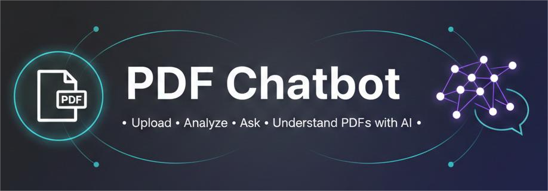
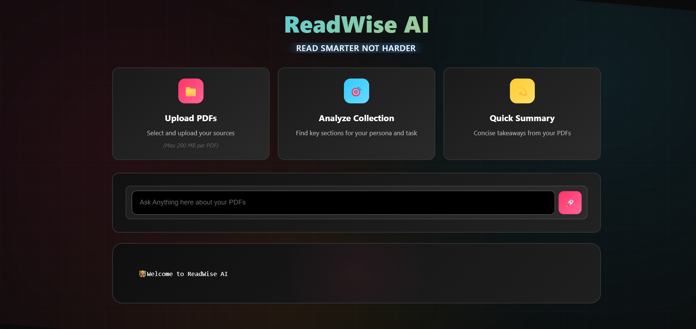
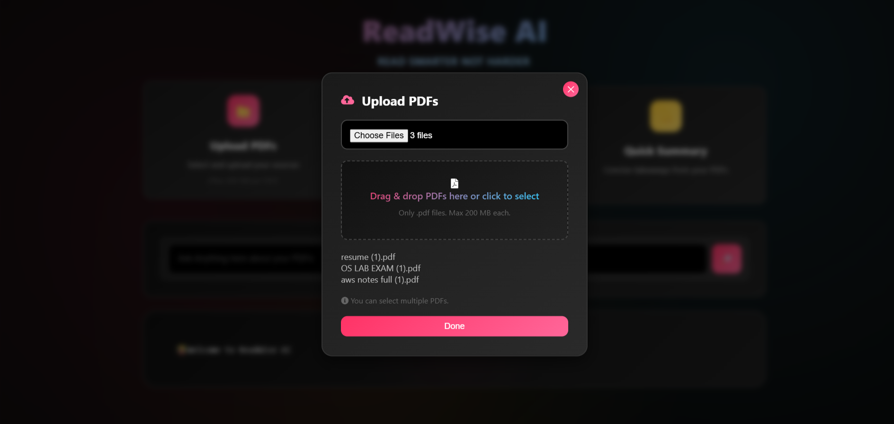
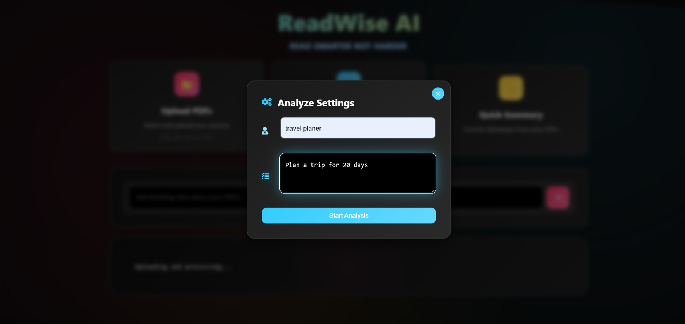
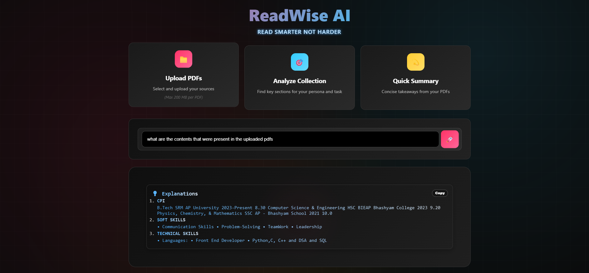
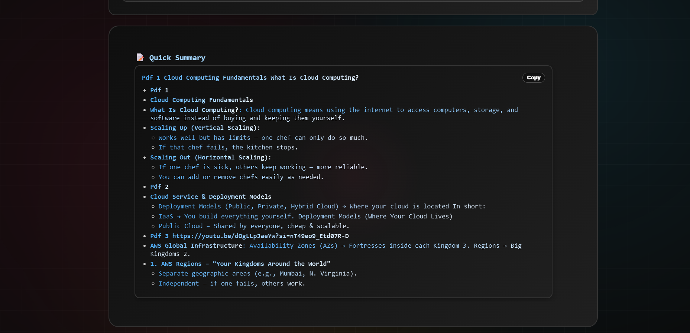
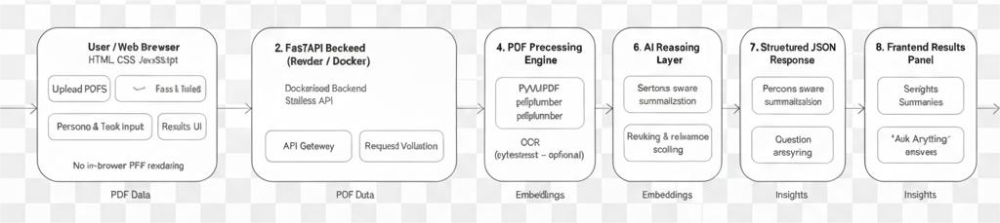

<a id="top"></a>

<p align="center">
  
</p>

<h1 align="center"> PDF Chatbot</h1>

<p align="center">
Upload  Analyze  Ask  Understand PDFs with AI
</p>

<p align="center">
  
  
  
  
</p>

# PDF Chatbot – Upload, Analyze & Chat with PDFs

AI-powered web app to **upload PDFs**, **analyze them with AI**, and **ask questions** about their content.  
No in-page PDF viewer — just clean, fast, and interactive analysis.

**Live Demo:** [https://pdf-chatbot-chi.vercel.app/](https://pdf-chatbot-chi.vercel.app/)

---

## Table of Contents
- [ Quick Start](#-quick-start)
- [ Why PDF Chatbot?](#-why-pdf-chatbot)
- [ Demo & Screenshots](#-demo--screenshots)
- [ System Architecture](#-system-architecture)
- [ Features at a Glance](#-features-at-a-glance)
- [ Tech Stack](#-tech-stack)
- [ Installation](#-installation)
- [Usage](#usage)
- [Project Structure](#project-structure)
- [ Security & Privacy](#-security--privacy)
- [ Roadmap](#-roadmap)
- [Troubleshooting](#troubleshooting)
- [ Contributing](#-contributing)
- [ Acknowledgements](#-acknowledgements)
- [ License](#-license)
- [Author](#author)

---

##  Quick Start

```bash
git clone <your-repo-url>
cd PDF_CHATBOT
docker build -t pdf-chatbot-backend ./backend
docker run -e PORT=8000 -p 8000:8000 pdf-chatbot-backend
```

Open the frontend at http://localhost:8080 and start chatting with PDFs 

<p align="right">(<a href="#top"> Back to top</a>)</p>

---

##  Why PDF Chatbot?

PDFs contain valuable information, but extracting insights from long documents is time-consuming and frustrating.

PDF Chatbot solves this by allowing you to:
- Upload multiple PDFs
- Define a persona and goal
- Instantly receive structured insights, summaries, and answers

No scrolling. No guessing. Just answers.


---

##  Demo & Screenshots

## 🎥 Demo & Screenshots

### 🏠 Home Dashboard
<p align="center">
  
</p>
<p align="center"><i>Clean landing dashboard with quick actions for PDF analysis</i></p>

---

### 📂 Upload PDFs
<p align="center">
  
</p>
<p align="center"><i>Drag-and-drop PDF upload with multi-file support</i></p>

---

### ⚙️ Analysis Settings (Persona & Task)
<p align="center">
  
</p>
<p align="center"><i>Define persona and job-to-be-done for focused analysis</i></p>

---

### 💬 Ask Anything Interface
<p align="center">
  
</p>
<p align="center"><i>Ask natural language questions across uploaded PDFs</i></p>

---

### 🧠 AI-Powered Insights & Results
<p align="center">
  
</p>
<p align="center"><i>Structured explanations, summaries, and extracted sections</i></p>


<p align="right">(<a href="#top"> Back to top</a>)</p>

---

##  System Architecture



### Flow Overview
1. User uploads PDFs via frontend
2. Backend extracts text, structure & tables
3. Semantic ranking identifies relevant sections
4. Persona & task guide AI output
5. Results returned as structured JSON

<p align="right">(<a href="#top"> Back to top</a>)</p>

---

##  Features at a Glance

-  Multi-PDF Upload & Analysis
-  Persona-driven AI understanding
-  Semantic search & ranking
-  Structured summaries & explanations
-  Fast, no embedded PDF viewer
-  Fully Dockerized backend
-  Light & Dark mode UI

<p align="right">(<a href="#top"> Back to top</a>)</p>

---

##  Tech Stack

**Frontend**
- HTML, CSS, Vanilla JavaScript (fully custom, no frameworks)
- Font Awesome (CDN) for icons
- Custom animations & responsive design with pure CSS
- Fetch API + XMLHttpRequest for backend communication and progress tracking
- Static site — runs without build tools or bundlers

**Backend**
- Python 3.9+, FastAPI 0.110.0, Uvicorn 0.29.0
- PyMuPDF, pdfplumber, Pillow, pytesseract
- sentence-transformers, torch, scikit-learn, nltk, numpy<2.0
- CORS enabled
- Dockerized for deployment

**Deployment**
- Frontend  Vercel
- Backend  Render

---

##  Installation

1. **Clone the repository**
   ```bash
   git clone <your-repo-url>
   cd PDF_CHATBOT
   ```
2. **Build the backend Docker image:**
   ```bash
   docker build -t pdf-chatbot-backend ./backend
   ```
3. **Run the backend:**
   ```bash
   docker run -e PORT=8000 -p 8000:8000 pdf-chatbot-backend
   ```
4. **Serve the frontend:**
   - Use VSCode Live Server, Python `http.server`, or any static server:
     ```bash
     cd frontend
     python -m http.server 8080
     # or use Live Server extension in VSCode
     ```
   - Open [http://localhost:8080](http://localhost:8080)

---

## Usage
1. Click Upload PDFs  drag & drop or select files
2. Click Done to upload
3. Click Analyze Collection, enter a persona and job/task, then click Start Analysis
4. Or click Quick Summary for fast document takeaways
5. Use Ask Anything to query explanations

---

## Project Structure
```
PDF_CHATBOT/
 backend/
    main.py                  # FastAPI app
    analyze_collections.py   # Semantic analysis
    heading_extractor.py     # PDF structure extraction
    summary.py               # Summary generation
    explain.py               # Explanations
    setup_offline_assets.py  # Offline cache/setup
    requirements.txt         # Python dependencies
    Dockerfile               # Container build file
 frontend/
    index.html
    script.js
    style.css
    ...
 README.md
 ...
```

---

##  Security & Privacy

- No in-browser PDF embedding
- Files processed securely on backend
- No chat history stored
- Minimal local storage usage

<p align="right">(<a href="#top"> Back to top</a>)</p>

---

## Troubleshooting
- If Analyze button is disabled: select at least one PDF and fill both persona & job fields
- If analysis fails: check backend logs, CORS, or API URL in `script.js`
- For Docker issues: ensure ports are mapped and backend is running

---

##  Roadmap

-  RAG-based long-context QA
-  Multi-language support
-  Persona presets
-  Confidence scoring & citations
-  Offline mode

<p align="right">(<a href="#top"> Back to top</a>)</p>

---

##  Contributing
Contributions are welcome!  
If you'd like to improve this project, please follow these steps:  
1. Fork the repository  
2. Create a feature branch (`git checkout -b feature-name`)  
3. Commit your changes (`git commit -m 'Add new feature'`)  
4. Push to your branch (`git push origin feature-name`)  
5. Open a Pull Request  

---

##  Acknowledgements
This project wouldnt be possible without these amazing tools and libraries:  
- [FastAPI](https://fastapi.tiangolo.com/) – Backend framework  
- [Sentence Transformers](https://www.sbert.net/) – Embeddings and NLP  
- [PyMuPDF](https://pymupdf.readthedocs.io/) – PDF parsing  
- [pdfplumber](https://github.com/jsvine/pdfplumber) – Text extraction  
- [pytesseract](https://pypi.org/project/pytesseract/) – OCR  
- [Tailwind CSS](https://tailwindcss.com/) & [Bootstrap](https://getbootstrap.com/) – Styling  
- [Font Awesome](https://fontawesome.com/) – Icons  

---
## License
MIT

## Author
- Developed by Gudiwada Sruthi
